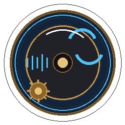

<p align="center">
    
</p>
<h1 align="center">Create: Webdisc<br><br>
    <a href="https://github.com/qwer854645/create_webdisc"></a>
</h1>

> **This is not the official Create: Harmonics mod.**  
> **Create: Webdisc** is an **independent derivative work** with **replaced art assets** and a **different mod ID**.  
> Official releases: [bitmochibit/createharmonics](https://github.com/bitmochibit/createharmonics) (upstream assets are All Rights Reserved).

<h4 align="center">Required dependencies<br><br>
    <a href="https://modrinth.com/mod/kotlin-for-forge">
        
    </a>
    <a href="https://modrinth.com/mod/create">
        
    </a>
</h4>

<hr>

## 代码来源与二次创作声明

**本项目（Create: Webdisc / 机械动力：网络唱片）是一次二次创作（derivative work），不是官版 Create: Harmonics 的重新上传或官方续作。**

| 项目 | 说明 |
|------|------|
| **代码来源** | 玩法与功能代码源自上游开源项目 [bitmochibit/createharmonics](https://github.com/bitmochibit/createharmonics)（作者 Leonardo Importuna / mochibit），上游**代码**许可为 [MIT License](https://github.com/bitmochibit/createharmonics/blob/master/LICENSE.MD) |
| **本项目性质** | 在 MIT 许可允许的范围内 fork 并修改代码后，以**新 Mod ID**（`create_webdisc`）、**新名称**与**原创美术**独立再发行 |
| **与官版关系** | 与上游作者及 **Create: Harmonics** 品牌**无隶属、无授权、无官方合作**；不得与官版 JAR 互换或混为同一模组 |
| **美术来源** | 官版 `assets/` 为 **All Rights Reserved**，**未**包含在本仓库中；本仓库 `assets/create_webdisc/` 为二次创作的替换资源（见 [LICENSE.MD](LICENSE.MD)） |
| **维护者** | 本 fork / 二次创作版本由 **qwer854645** 维护；问题请提交到[本仓库 Issues](https://github.com/qwer854645/create_webdisc/issues)，请勿到上游报本 fork 的 bug |

### Code provenance & derivative work (English)

**Create: Webdisc** is a **derivative work**, not a re-upload of the official **Create: Harmonics** mod.

- **Source code:** Forked from [bitmochibit/createharmonics](https://github.com/bitmochibit/createharmonics) by Leonardo Importuna (mochibit), licensed under **MIT** for the code portions described in upstream [LICENSE.MD](https://github.com/bitmochibit/createharmonics/blob/master/LICENSE.MD).
- **This distribution:** Republished under a **new mod ID** (`create_webdisc`), **new branding**, and **replacement artwork** maintained by **qwer854645**.
- **No affiliation:** Not affiliated with the upstream author or the Create: Harmonics brand. Upstream ARR artwork is **not** shipped in this project.
- **Compliance:** MIT copyright and permission notices for upstream code are preserved in [LICENSE.MD](LICENSE.MD).

---

## Quick facts

| | Official upstream | **This fork** |
|---|---|---|
| Mod ID | `createharmonics` | **`create_webdisc`** |
| Display name | Create: Harmonics | **Create: Webdisc** |
| Maintainer | Leonardo Importuna (mochibit) | qwer854645 |
| `assets/` license | All Rights Reserved | MIT (replacement art only) |
| Code license | MIT | MIT (based on upstream) |
| Can swap JARs in a save? | — | **No** — block/item IDs differ |

Do **not** install this alongside the official mod expecting the same namespace. Worlds that used `createharmonics:*` blocks will **not** migrate automatically; treat this as a separate mod.

---

## What this project is

**Create: Webdisc** is a NeoForge 1.21.1 **derivative addon** built on MIT-licensed code from [bitmochibit/createharmonics](https://github.com/bitmochibit/createharmonics). It is **secondary creation** (二次创作): same general gameplay idea, but a separate mod with its own ID, name, textures, and maintainer.

Gameplay: URL audio, Webdiscs, Andesite Web Players, Webdisc Imprinter, Create contraption integration. Upstream [wiki](https://github.com/bitmochibit/createharmonics/wiki) may be used as a **reference only** for mechanics — it documents the original mod, not this fork.

**Report bugs for this fork here:** [Issues](https://github.com/qwer854645/create_webdisc/issues) — not on the upstream repo.

---

## How this fork differs from upstream

### Removed (upstream ARR or unused)

- Upstream mod logo (`logo.png`) and Blockbench (`.bbmodel`) sources
- Upstream `docs/` translation website and its image assets
- **Brass Jukebox** block art (block was already disabled in code; texture removed from this fork)

### Replaced (safe to redistribute under this fork's asset terms)

- Record item / 3D record textures
- Andesite Jukebox and Record Press Base textures
- GUI textures (`logo_small`, icons, record press screen)
- Custom sounds (procedural OGG)
- Ponder scene NBT and GameTest structure NBT (regenerated, not byte-copied from upstream)

### Added in this fork

- `zh_cn` tooltips and Ponder translations
- Bilibili yt-dlp patch script: `tools/repatch-ytdlp-bilibili.ps1`
- Clear **Unofficial** branding in mod list, creative tab, and in-game menus

### Not bundled, but referenced at runtime

- **Create** textures (e.g. `create:block/brass_casing` on the record press model) — loaded from the Create mod, not shipped in this JAR
- **ffmpeg** / **yt-dlp** — downloaded locally with user consent, or placed manually under `audio_providers/`

See [LICENSE.MD](LICENSE.MD) for the full asset/code split.

---

## What the mod does

- Craft **Webdiscs** and bind them to online audio URLs
- Power an **Andesite Web Player** or **Webdisc Imprinter** with Create rotation
- Play audio on contraptions; pitch and playback follow speed and redstone

Audio is streamed **client-side** from the original source (not relayed server → client). The mod may download **ffmpeg** and **yt-dlp** after asking permission, or you can supply your own binaries.

> [!IMPORTANT]
> Respect the terms of service of any site you pull audio from. This mod does not host audio.

---

## Installation

**Minecraft:** 1.21.1 · **Loader:** NeoForge · **Requires:** Create + Kotlin for Forge

1. Download **`create_webdisc-neoforge-1.21.1-*.jar`** from [Releases](https://github.com/qwer854645/create_webdisc/releases) or build locally (below).
2. Put the JAR in your `mods` folder.
3. **Do not** use the official `createharmonics-*.jar` — mod ID and assets differ.
4. On first launch, accept the in-game prompt to install ffmpeg/yt-dlp, or install them manually (path shown in the library setup screen).

For Bilibili URLs after a fresh yt-dlp install, run:

```powershell
.\tools\repatch-ytdlp-bilibili.ps1
```

---

## Build from source

**Requirements:** JDK 21

```powershell
$env:JAVA_HOME = "C:\Program Files\Java\jdk-21.0.10"
cd create_webdisc
.\gradlew.bat :neoforge:build
```

Output JAR:

```text
neoforge/build/libs/create_webdisc-neoforge-1.21.1-2.0.0.jar
```

Run client (dev):

```powershell
.\gradlew.bat :neoforge:runClient
```

Default game directory: `neoforge/run`

### Regenerate assets (optional)

```bash
python tools/generate_assets.py
python tools/generate_ponder_nbt.py
python tools/patch_gametest_nbt.py
```

Asset root: `common/src/main/resources/assets/create_webdisc/`

---

## Legal summary

| Part | License | Notes |
|------|---------|--------|
| Upstream **source code** | MIT | © Leonardo Importuna — [bitmochibit/createharmonics](https://github.com/bitmochibit/createharmonics) |
| This project's **code changes** | MIT | Derivative modifications on top of upstream MIT code |
| This project's **assets** | MIT | Original / regenerated replacement art — see [LICENSE.MD](LICENSE.MD) |
| Upstream **original art** | All Rights Reserved | **Not included** in this repository or JAR |

This project is a **derivative work (二次创作)** and is **not affiliated** with Leonardo Importuna (mochibit), the Create: Harmonics brand, the Create team, YouTube, Bilibili, or other audio platforms. Provided as-is, without warranty.

---

## Credits

- **Upstream code (MIT):** [bitmochibit/createharmonics](https://github.com/bitmochibit/createharmonics) by Leonardo Importuna (mochibit) — original Create: Harmonics gameplay implementation
- **This derivative work:** Create: Webdisc — code fork, rebranding, and replacement assets by **qwer854645**
- [Create](https://github.com/Creators-of-Create/Create) — MIT
- [yt-dlp](https://github.com/yt-dlp/yt-dlp) — Unlicense (source); official `.exe` builds may be GPLv3+
- [ffmpeg](https://ffmpeg.org/) — LGPL/GPL depending on build
